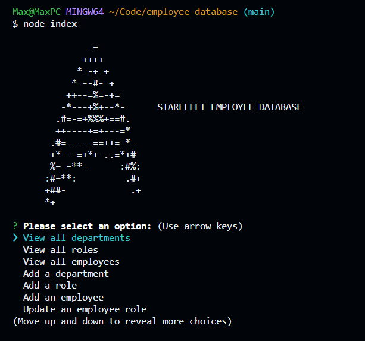

# Employee Tracker Database
This is a command line application that allows the user to interact with a MySQL database of employees, roles, and departments.  You can view the information in the database as well as add, delete, or update information.

## Installation
Clone the repo to your computer, open your terminal in the root directory of the application, and run `npm i` to download the necessary node packages.

---

[`Video`]()
---

Powered by [node.js](https://nodejs.org/en), [mysql2](https://www.npmjs.com/package/mysql2), and [Inquirer](https://www.npmjs.com/package/inquirer)